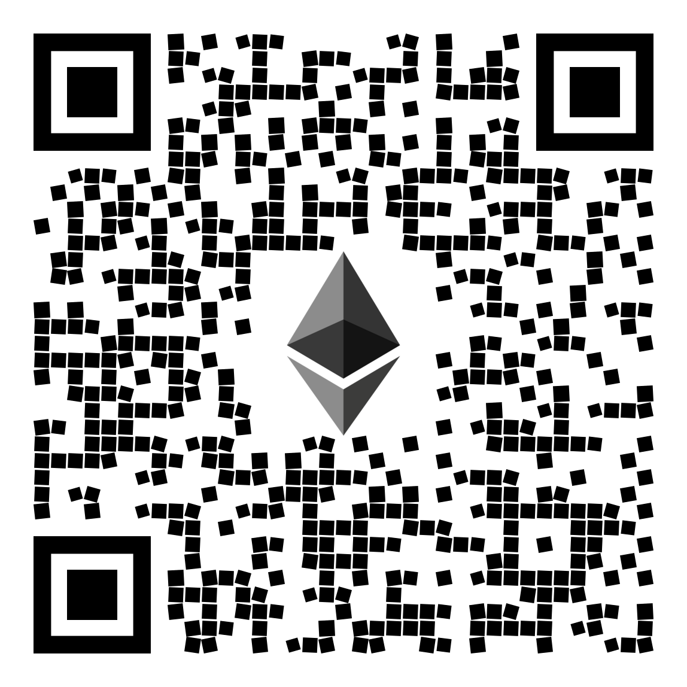

## Ethereum (ETH)

**Network:** Ethereum — **Mainnet (ERC-20)**  
**Address:** `0x5D8D51fC6563b4f4fFC26B8390aeeD2F5f0CE719`

**Send as:** ETH on **Ethereum Mainnet only**.  
**Tokens:** Only **ERC-20 tokens on Ethereum Mainnet** (do not use BSC/Polygon/Arbitrum/Optimism/Base).  
**Memo/Tag:** Not required.